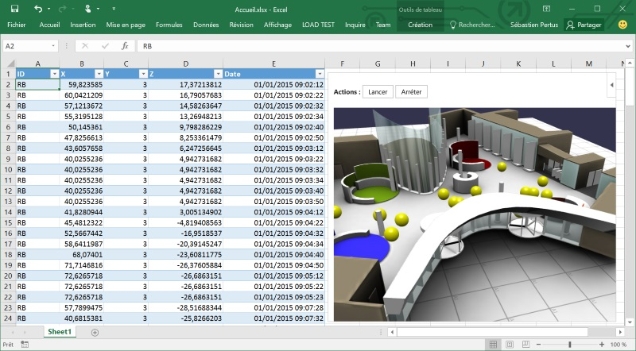
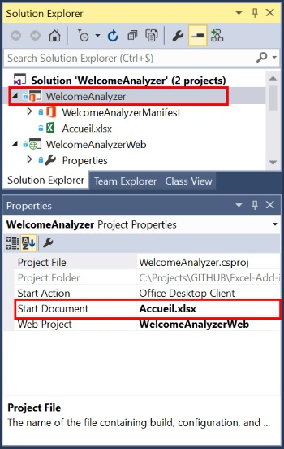

# Excel-Add-in-JS-BabylonJS
This is an Excel add-in that show how to deliver a great experience within a 3D scene for viewing Excel datas.

It is using [http://www.babylonjs.com](BabylonJS), a full JavaScript 3D engine.

# In a Nutshell

This add-in takes all the datas from the current worksheet and inject them in the 3D **BabylonJS** Scene.

Every rows contains a position, and the associated position date & time.

The 3D scene produce a cool and smoothy pathfinding animation for each element, showing you how the people are moving into the **Microsoft France lobby**.

The sample is constructed with :
- Visual Studio 2015
- TypeScript 
- Office.js SDK for add-in
- BabylonJS SDK

# Try it out

## Get the sample

Clone or download the sample, open it with **Visual Studio 2015**.

Please check in add in project if the start object is "*Accueil.xls*".  
This Excel file contains pre-populated datas, mandatory for the demo :

Hit **F5** and try it !

## Considerations

You will find the useful code in **App/Welcome/Tracker.ts** file :

- Function **playDatas** : get the rows from the Excel worksheet and create every animations.
- Function **_setTableBinding** : Create a binding using the *addFromNamedItemAsync* method.
- Function **_createScene** : Create the BabylonJS scene importing models, textures dans visuals assets.
- Function **launchScene** : Launch and render the scene. This method is called from the *welcome.html* page.
- Function **resetDatas** : Stop the animations, reset all positions and clean the scene.

